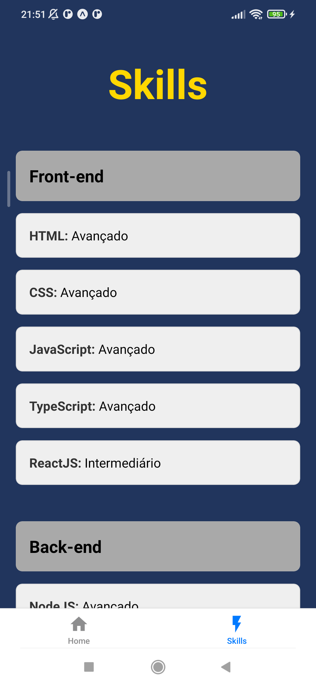

# Portfólio Mobile

Um aplicativo de portfólio pessoal, moderno e multiplataforma, desenvolvido com **React Native** e **Expo**. O projeto foi criado para apresentar informações profissionais, habilidades e links de contato de uma maneira elegante e de fácil acesso.


## Funcionalidades Principais

Com base nas tecnologias utilizadas, o aplicativo inclui as seguintes funcionalidades:

  * **Navegação por Abas:** Interface principal organizada com uma barra de navegação inferior (`Bottom Tabs`) para alternar facilmente entre as seções "Sobre Mim", "Habilidades", etc.
  * **Links Interativos:** Permite que os usuários cliquem para abrir URLs em um navegador, facilitando o acesso a redes sociais e outros perfis.
  * **Copiar para a Área de Transferência:** Funcionalidade de "copiar com um toque" para informações como e-mail ou telefone, melhorando a experiência do usuário (`expo-clipboard`).
  * **Notificações Visuais:** Exibição de feedback visual para o usuário (como "Texto copiado\!") através de mensagens de brinde (`react-native-toast-message`).
  * **Layout Responsivo e Seguro:** A interface se adapta a diferentes tamanhos de tela e respeita as áreas de segurança de dispositivos com notch ou ilhas dinâmicas (`react-native-safe-area-context`).


## Screenshots





## Tecnologias e Bibliotecas

Este projeto foi construído utilizando um ecossistema moderno de desenvolvimento mobile:

  * **Core:**

      * [React Native](https://reactnative.dev/): Estrutura para criar aplicativos nativos usando React.
      * [Expo](https://expo.dev/): Plataforma e conjunto de ferramentas para simplificar o desenvolvimento e a implantação de apps React Native.
      * [TypeScript](https://www.typescriptlang.org/): Superset do JavaScript que adiciona tipagem estática para um código mais robusto.

  * **Navegação:**

      * [React Navigation](https://reactnavigation.org/): Solução completa para roteamento e navegação no app.
      * `@react-navigation/bottom-tabs`: Implementação da navegação por abas inferiores.

  * **Componentes de UI/UX:**

      * `expo-clipboard`: Para interagir com a área de transferência do sistema.
      * `react-native-toast-message`: Para exibir notificações flutuantes (toasts).
      * `react-native-safe-area-context`: Para garantir que a UI não seja obstruída por elementos do sistema.


## Como Rodar o Projeto

Siga os passos abaixo para executar o projeto em seu ambiente de desenvolvimento.

### Pré-requisitos

  * [Node.js](https://nodejs.org/) (versão LTS recomendada)
  * [Git](https://git-scm.com/)
  * O aplicativo **Expo Go** em seu dispositivo móvel (Android/iOS) ou um emulador/simulador configurado.

### Instalação e Execução

1.  **Clone o repositório:**

    ```bash
    git clone https://github.com/ViniciussdeOliveira/Portifolio-App.git
    ```

2.  **Acesse a pasta do projeto:**

    ```bash
    cd Portifolio-App # ou o nome da pasta local
    ```

3.  **Instale as dependências:**

    ```bash
    npm install
    # ou, se preferir o Yarn:
    # yarn install
    ```

4.  **Execute o servidor de desenvolvimento Expo:**

    ```bash
    npx expo start
    ```

5.  Após o servidor iniciar, **escaneie o QR Code** exibido no terminal usando o aplicativo **Expo Go** no seu celular.

### Scripts Disponíveis

Você também pode usar os scripts do `package.json` para direcionar a uma plataforma específica:

  * `npm run android`: Inicia o app em um emulador Android ou dispositivo conectado.
  * `npm run ios`: Inicia o app em um simulador iOS (requer macOS).
  * `npm run web`: Inicia o app em um navegador web (suporte experimental).

